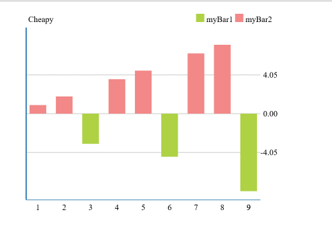
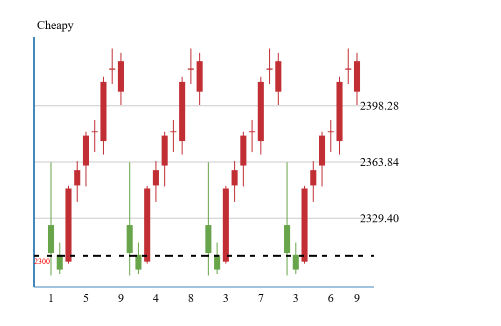

# html_canvas
## Preview
html_canvas 使用canvas绘制一些简单的图形：line，bar，k线图。   
基于Zepto，使用方式如下：
```html
    <script src="js/zepto-1.1.4.min.js" type="text/javascript"></script>
    <script src="js/cheapy_chart.js" type="text/javascript"></script>
```
## 线形图（line）
代码参见line.html

## 条形图（bar)
代码插件bar.html

## k线图（kline)
代码参见kline.html

## Options
```javascript
{
  animation: {
    enable : true, 
    // true or false, 是否开启动画效果，由于搜狗浏览器的支持效果不太好，搜狗浏览器不支持动画效果
    time: 1000 // 动画时间，ms 
  },
  title:{
    position: "left", 
    // title的显示位置（left | right），默认left
    x: 33, 
    // 距离边框的x位置，如果position为left，则表示相对左边框的位置，
    // position为right，则表示相对右边框的位置
    y: 10,
    // 相对上边框的位置
    show: true,
    // 是否显示title，(true | false)，默认显示
    name: "Cheapy Chart",
    textStyle: {
        weight: "bold"
    }
    // title的字体属性，包括以下字段
    // weight，size，family
  },
  legend: {
    show: false,
    // 是否显示图例（true | false）
    position: "right",
    // 图例的位置（right | left），默认right
    x: 10,
    // 相对左(右)边框的距离，如果position为left，则相对左边框，否则相对右边框
    y: 10,
    // 相对上边框的距离
    textStyle: {
        size: 12,
        weight: "bold"
    }
    // 文字的属性size, weight, family
  },
  tooltip: {
      show: true,
      // 是否显示hover是的提示信息，默认不显示
      lineStyle: {
          color: '#48b',
          width: 1,
          type: 'solid'
      },
      // 提示的线条的样式，颜色，宽度以及类型（solid/dot）
      formatter: function(){
          return "Hello Cheaphy!";
      },
      // 提示的文字
      position: function(arr){
          return arr;
      }
      // 文字的位置，返回信息点的值[x, y]
  },
  xAxis: {
      show: true,
      // 是否显示X轴
      name: "x轴",
      // X轴的名称
      boundaryGap: [0.02,0.02],
      // 左右边界的距离，总距离按1计算
      axisLabel:{
          show: true,
          formatter: function(value){
              return value;
          },
          x: 0,
          y: 5,
          textStyle: {
              fontSize: 12
          }
      },
      // 坐标轴标签
      axisLine: {
          show: true,
          onZero: true,
          position: "bottom",
          lineStyle: {
              color: '#48b',
              width: 1,
              type: 'solid'
          }
      },
      // 坐标轴样式
      splitLine: {
          show: true,
          first: false,
          last: false,
          count: 4,
          lineStyle:{
              color: ['#ccc'],
              width: 1,
              type: 'solid'
          }
      },
      // 分界线样式
      data: [] 
      // 数值
  },
  yAxis: {
      show: true,
      // 是否显示y轴
      name: "y轴",
      // y轴名称
      boundaryGap: [0.02,0.02],
      // 下边界，上边界的间距，总高度按1计算
      axisLabel:{
          show: true,
          position: "right",
          x: -25,
          y: 8,
          formatter: function(value, index, list){
              if(index === 0 || index === list.length - 1){
                  return null;
              }
              return value;
          },
          textStyle: {
              size: 12
          }
      },
      // 坐标轴标签
      axisLine: {
          show: true,
          onZero: true,
          position: "left",
          lineStyle: {
              color: '#48b',
              width: 2,
              type: 'solid'
          }
      },
      // 坐标轴样式
      splitLine: {
          show: true,
          count: 4,
          first: false,
          last: false,
          lineStyle: {
              color: '#ccc',
              width: 1,
              type: 'solid'
          }
      }
      // 分界线样式
  },
  position: {
      x: 30,
      y: 30,
      x2: 30,
      y2: 20
  },
  // 图标相对左边(x)/右边(x2)/上边(y)/下边(y2)的距离
  font: {
      size: 12,
      family: "Times New Roman",
      weight: "normal"
  },
  // 默认字体样式
  base:{
      upColor: "#c12e34",
      // k线图涨的样式
      downColor: "#68a54a",
      // k线图跌的样式
      backgroundColor: "#fff",
      // 背景颜色
      color: "#000",
      // 字体的颜色
      markStyle: {
          width: 2,
          color: "#48b"
      }
      // 标记线的样式
  }
  // 默认线条样式
}
```
## 扩展
```javascript
CheapyChart.registerType(name, {
  render: function(){
  
  }
});
```
